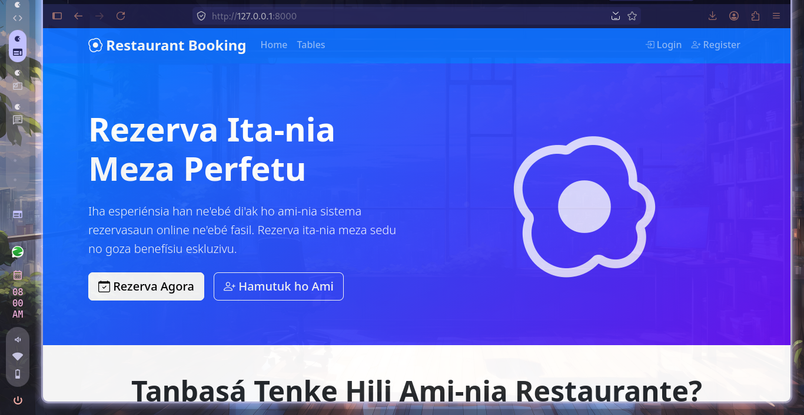
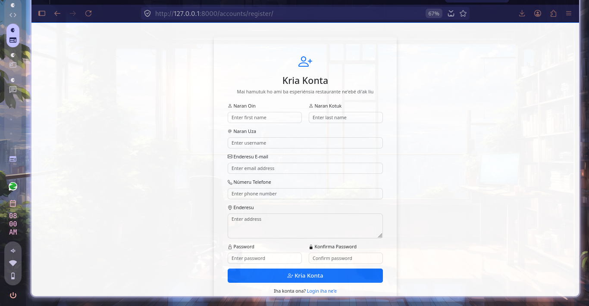
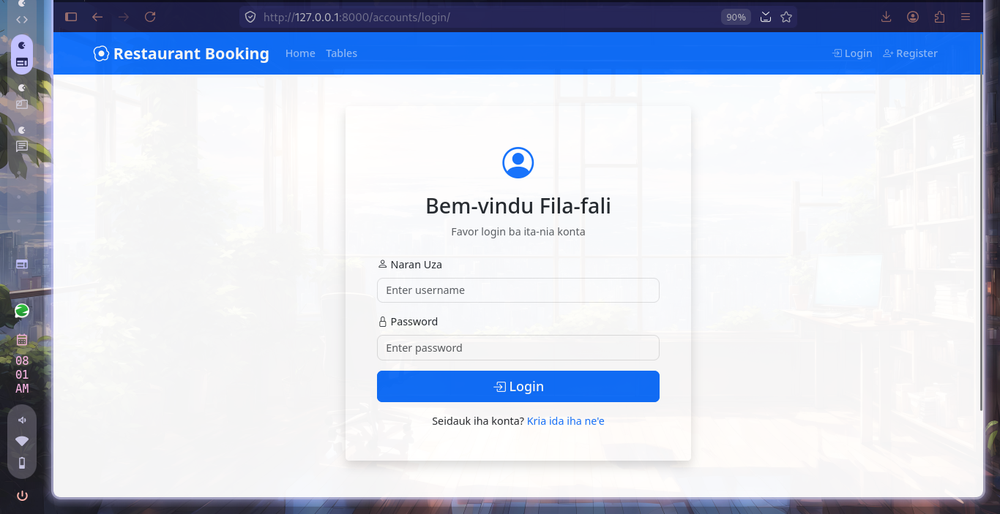
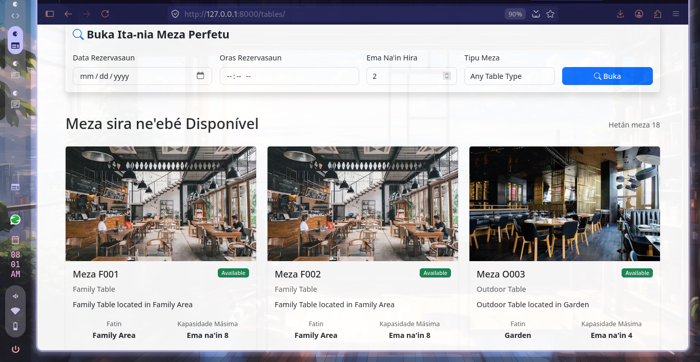

# 📸 Screenshots — b_Restaurant

---

## 🏠 1. Home Page
> URL: `http://127.0.0.1:8000/`  
> File: `docs/screenshots/01_home.png`

<!-- Replace this comment with your screenshot -->
```
[ Screenshot: Home page showing featured tables and table type categories ]
```


---

## 🔐 2. Register Page
> URL: `http://127.0.0.1:8000/accounts/register/`  
> File: `docs/screenshots/02_register.png`

<!-- Replace this comment with your screenshot -->
```
[ Screenshot: Registration form with fields for username, email, name, phone, address, password ]
```


---

## 🔑 3. Login Page
> URL: `http://127.0.0.1:8000/accounts/login/`  
> File: `docs/screenshots/03_login.png`

<!-- Replace this comment with your screenshot -->
```
[ Screenshot: Login form with username and password fields ]
```


---

## 🪑 4. Browse Tables
> URL: `http://127.0.0.1:8000/tables/`  
> File: `docs/screenshots/04_table_list.png`

<!-- Replace this comment with your screenshot -->
```
[ Screenshot: Table listing page with search/filter by type, party size, date, time ]
```


---

## 📁 Folder Structure for Screenshots

```
b_Restaurant/
└── docs/
    └── screenshots/
        ├── 01_home.png
        ├── 02_register.png
        ├── 03_login.png
        ├── 04_table_list.png


---

> 💡 **Tip:** Use a consistent browser window size (e.g. 1440×900) for all screenshots so they look uniform on GitHub.
